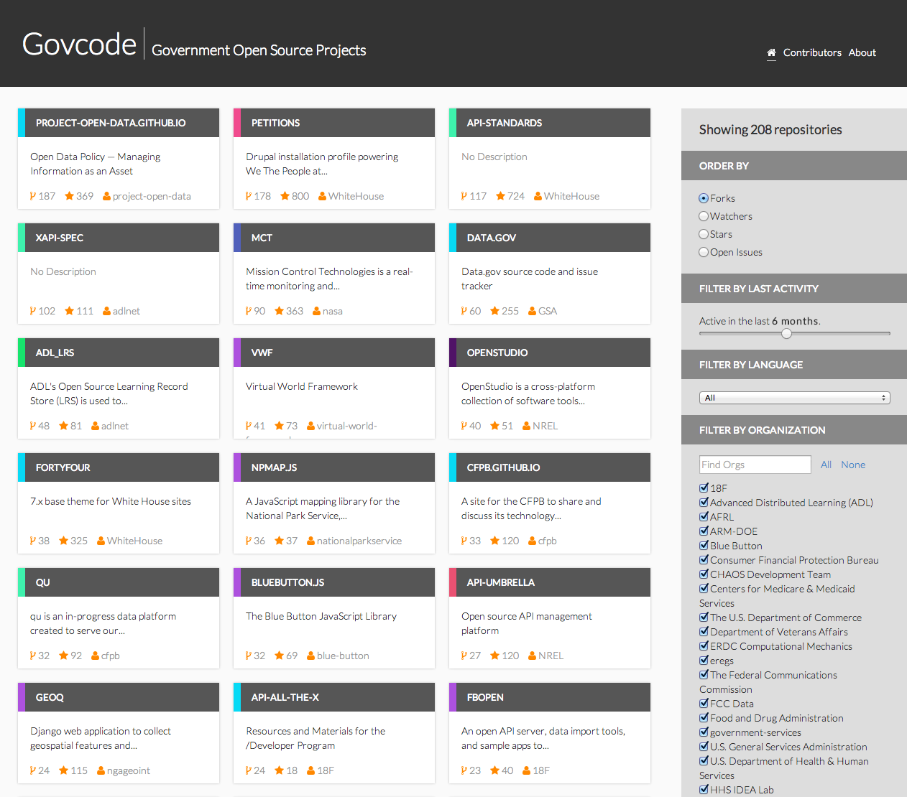

Govcode
=============

## What is this?

Govcode is an application that lists government open source projects.
The purpose is to track what is being worked on and build analytics on top of it.



## How to run it?

This application is structured as an API and a front end. The `common`, `govcode` and `govcoded` directories 
hold the API code while the `front` directory holds the front end.

All the steps mentioned below assume that you cloned the repo into a local folder.

To setup the API you need to do the following:
1. Build the `govcode` tool: 
```
cd govcode
go build
```
1. Set the environment variables for the Postgres database and Github API key: 
```
export GH_KEY="xxx"
export PG_CONN_STR="user=govcode password=govcode dbname=govcode sslmode=disable"
```
1. Migrate the database to build all the tables: 
  `govcode migrate`
1. (Optionally) Run an import to populate the DB: 
  `govcode import`

Now we have a loaded DB with the settings in the environment.

To actually run the server: 
```
cd govcoded
go run main.go
```

Or use [gin](https://github.com/codegangsta/gin): 
```
cd govcoded
gin
```

This should start the API on port 3000. You can change the port by setting the `PORT` environment variable.

To run the front end:
1. Get the npm packages: 
```
cd front
npm install
```
1. Get the bower packages: 
`bower install`
1. Run the server: 
`grunt serve`
1. Go to `http://localhost:9000` on your browser

If you see an error about `compass` you might need to install the [compass ruby gem](http://compass-style.org/install/): 
`gem install compass`

## Contributing

All contributions are welcome. You might want to create an issue describing what you want to work on 
to make sure the is no duplication.

## License

This project is licensed under the [MIT license](LICENSE).